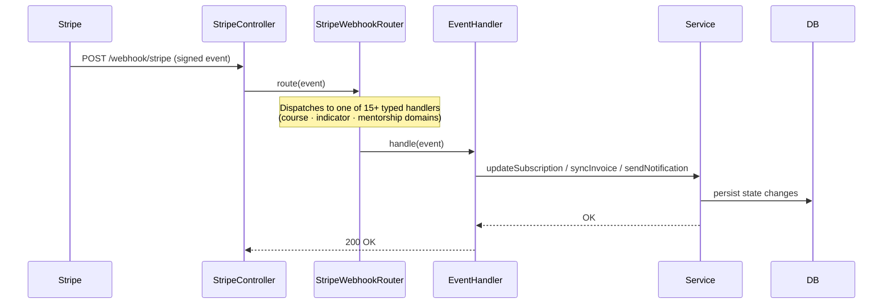
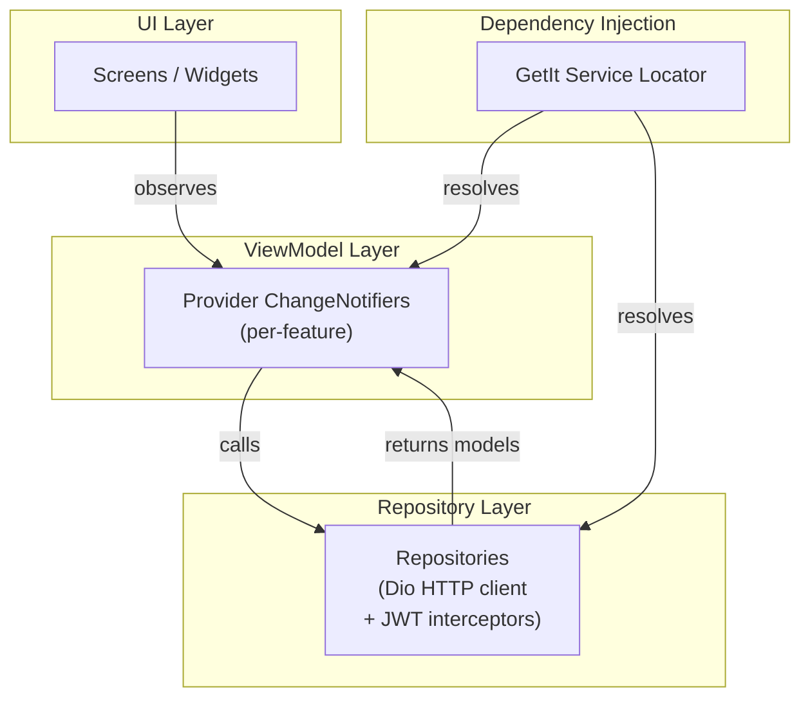

# Winning Circle Academy — Online Trading Education Platform

> A production-grade, five-component online trading education ecosystem built across mobile, web, and admin surfaces. The platform delivers structured video courses with DRM protection, live streaming, TradingView indicator access management, AI-powered financial news digests, mentorship programmes, a full Stripe subscription engine, affiliate tracking, Telegram bot integration, and automated PDF document generation — all served from a single Spring Boot API backing React web/admin SPAs and a Flutter mobile app.

---

## Table of Contents

1. [Platform Overview](#platform-overview)
2. [System Architecture](#system-architecture)
3. [Repository Structure](#repository-structure)
4. [Backend — Spring Boot 3 REST API](#backend--spring-boot-3-rest-api)
5. [Web Application — React Student Portal & Landing](#web-application--react-student-portal--landing)
6. [Admin Panel — React Backoffice](#admin-panel--react-backoffice)
7. [Mobile Application — Flutter iOS & Android](#mobile-application--flutter-ios--android)
8. [Morning Brief — AI Financial News Microservice](#morning-brief--ai-financial-news-microservice)
9. [Codebase Scale](#codebase-scale)
10. [Source Code Notice](#source-code-notice)

---

## Platform Overview

Winning Circle Academy is a comprehensive fintech-education platform aimed at teaching retail traders how to analyse financial markets and develop sustainable trading strategies. The platform serves two distinct user groups — **students** who learn through video courses, live streams, quizzes, and personal notes, and **backoffice operators** who manage all content, subscriptions, affiliates, and platform settings through a dedicated admin panel.

Beyond the core LMS, the platform includes:

- A **TradingView Pine Script indicator subscription system** that provisions and revokes access to proprietary indicators via the TradingView API, tied to Stripe billing cycles.
- A **mentorship marketplace** with structured subscription packages, application funnels, discount handling, refund tracking, and installment payment scheduling.
- An **AI-powered Morning Brief microservice** that aggregates real-time financial news from multiple RSS sources, scrapes full article text, deduplicates stories, runs OpenAI GPT for Turkish summarisation, enriches reports with economic calendar data, and delivers a styled HTML digest via a Telegram bot.
- A **multi-channel notification system** covering Firebase Cloud Messaging (push), Twilio SMS (OTP), Spring Mail (transactional email), and Telegram.
- Automated **PDF generation** for course completion certificates and invoices using a Thymeleaf + OpenHTMLtoPDF + FlyingSaucer rendering pipeline.

---

## System Architecture

### High-Level Component Diagram

```mermaid
graph TB
    subgraph Clients["Client Layer"]
        WEB["🌐 React Web App\nPublic Landing · Student Portal\nStripe · Radix UI · Zustand"]
        ADMIN["⚙️ React Admin Panel\nBackoffice · CMS · Analytics\nRadix UI · React Query · dnd-kit"]
        MOB["📱 Flutter Mobile\niOS & Android\nVdoCipher · Stripe IAP · MVVM"]
    end

    subgraph API["Spring Boot 3 REST API — Java 17"]
        direction TB
        SEC["Spring Security\nJWT · Firebase · Google · Apple"]
        LAND["Landing Controllers\nCourse · Blog · LiveStream\nIndicator · Mentorship · FAQ"]
        STU["Student Controllers\nAuth · Course · Video · Quiz\nSubscription · Affiliate · Note"]
        BO["Backoffice Controllers\nContent CRUD · Student Mgmt\nStatistics · Telegram Config"]
        WH["Webhook Controllers\nStripe · Telegram · Google Play"]
        SVC["Service Layer\n50+ Domain Services"]
        SCHED["ShedLock Scheduler\nDistributed cron jobs\n(subscription reminders,\n PDF generation)"]
        RLIMIT["Bucket4j\nRate Limiting"]
        PDF["PDF Engine\nThymeleaf + OpenHTMLtoPDF\n+ FlyingSaucer"]
        STRIPE_H["Stripe Webhook Router\n15+ Event Handlers\n(course · indicator · mentorship)"]
    end

    subgraph MB["Morning Brief Microservice — Python / FastAPI"]
        RSS["RSS Reader\nfeedparser · 10+ sources"]
        SCRAPE["Article Fetcher\ntrafilatura + BS4\nThreadPoolExecutor"]
        AI["AI Processor\nOpenAI GPT\nrelevance · dedup · translate · summarise"]
        ECOCAL["Economic Calendar\nMacro event enrichment"]
        REPGEN["HTML Report Generator\nCategorised digest"]
        TGBOT["Telegram Bot\npython-telegram-bot\nchannel delivery"]
    end

    subgraph Infra["Infrastructure & Third-Party Services"]
        PG[("PostgreSQL\n+ Flyway migrations\n62 versioned scripts")]
        S3[("AWS S3\nMedia · Documents")]
        FCM["Firebase Cloud\nMessaging — Push"]
        TWILIO["Twilio — SMS OTP"]
        STRIPE["Stripe\nSubscriptions · One-time\nInvoices · Webhooks"]
        VDOC["VdoCipher\nDRM Video Delivery"]
        TV["TradingView\nPine Script API\nAccess provisioning"]
        GMAPS["Google Maps API\nEvent locations"]
        RC["RevenueCat\nMobile IAP"]
        GOOGLE_PUB["Google Play Publisher\nIAP receipt verification"]
        APPLE_IAP["Apple StoreKit\nSign-in + IAP"]
        TELEGRAM["Telegram API\nBot & channel webhooks"]
    end

    WEB -->|"HTTPS REST"| API
    ADMIN -->|"HTTPS REST"| API
    MOB -->|"HTTPS REST"| API
    SEC --> LAND & STU & BO & WH
    LAND & STU & BO --> SVC
    WH --> STRIPE_H & SVC
    SVC --> PDF & SCHED & RLIMIT
    SVC --> PG & S3 & FCM & TWILIO & STRIPE & VDOC & TV & GMAPS & RC & GOOGLE_PUB & APPLE_IAP & TELEGRAM
    MB --> RSS --> SCRAPE --> AI --> REPGEN --> TGBOT
    ECOCAL --> REPGEN
```

### Stripe Webhook Event Flow

### Morning Brief Pipeline

```mermaid
flowchart LR
    A["🕐 Scheduled Trigger\n(daily / on-demand API)"] --> B
    B["📡 RSS Ingestion\nfeedparser\n10+ feeds · parallel"] --> C
    C["📰 Article Scraper\ntrafilatura + BS4\nThreadPoolExecutor"] --> D
    D["🤖 AI Relevance Filter\nOpenAI GPT\nper-article scoring"] --> E
    E["🔁 Story Deduplication\nGPT cross-source\nclustering"] --> F
    F["📊 Source & Topic\nDiversity Filter\nmax/source · max/topic"] --> G
    G["🌍 GPT Translation\nTurkish headlines\n& summaries"] --> H
    H["📅 Economic Calendar\nmacro event enrichment"] --> I
    I["📄 HTML Report\nGeneration"] --> J
    J["✉️ Telegram Bot\nchannel delivery"]
```

### Mobile MVVM Architecture

---

## Repository Structure

| Repository | Language / Runtime | Primary Role | Key Technologies |
|---|---|---|---|
| `winning-circle-academy-backend` | Java 17 / Spring Boot 3.2 | Core REST API, business logic, webhook processing | Spring Security · JPA · Flyway · ShedLock · Bucket4j · Stripe · Firebase |
| `winning-circle-academy-web` | React 18 / Node | Public landing pages + authenticated student portal | Radix UI · Zustand · TanStack Query · Tailwind CSS · Stripe.js · Framer Motion |
| `winning-circle-academy-admin` | React 18 / Node | Backoffice CMS, analytics, and platform management | Radix UI Themes · dnd-kit · Recharts · TanStack Query · React Quill |
| `winning-circle-academy-mobile` | Flutter 3 / Dart | Cross-platform student app (iOS & Android) | VdoCipher · Provider · GetIt · Dio · Flutter Quill · In-App Purchase |
| `winning-circle-academy-morning-brief-api` | Python 3 / FastAPI | AI financial news digest microservice | OpenAI GPT · feedparser · trafilatura · python-telegram-bot |

---

## Backend — Spring Boot 3 REST API

### Core Stack

The backend is a single-deployable **Spring Boot 3.2** application built on Java 17. It exposes a layered REST API partitioned by audience — `/landing/**` (public, unauthenticated), `/student/**` (JWT-authenticated, `STUDENT` role), `/backoffice/**` (JWT-authenticated, `BACKOFFICE_USER` role), and `/webhook/**` (verified by provider signature). The service layer comprises over **50 domain services** backed by more than **60 Flyway migration scripts** representing the full evolution of the database schema.

### Authentication & Security

The security model is stateless (JWT, `SessionCreationPolicy.STATELESS`) with a custom `JwtAuthenticationFilter` sitting in front of Spring Security's filter chain. Token generation uses **JJWT 0.11** and **Auth0 java-jwt**. Social authentication is handled through **Firebase Admin SDK** (Google OAuth token exchange) and a dedicated **`AppleTokenService`** implementing Apple Sign-In JWT verification. Two-factor authentication (TOTP) is implemented via the **`googleauth`** library. OTP delivery for email-change and phone-verification flows uses **Twilio SMS** through `OtpService`.

### Payment & Subscription Engine

The subscription system is one of the most architecturally complex parts of the platform. Stripe integration (`stripe-java 28.3`) covers three distinct billing domains — **course subscriptions**, **TradingView indicator subscriptions**, and **mentorship subscriptions** — each modelled as separate JPA entity hierarchies:

- `StudentStripeSubscription` / `StudentManualSubscription` — course access
- `StudentIndicatorStripeSubscription` / `StudentIndicatorManualSubscription` — TradingView indicator access
- `StudentMentorshipStripeSubscription` / `StudentMentorshipManualSubscription` / `StudentMentorshipDiscountSubscription` — mentorship access

Each domain has its own set of **Stripe webhook event handlers** (`StripeWebhookRouter` dispatches to 15+ typed `StripeEventHandler` implementations: `InvoicePaidHandler`, `SubscriptionCreatedHandler`, `SubscriptionDeletedHandler`, `InvoiceMarkedUncollectibleHandler`, etc.) and its own invoice sync service. Mobile in-app purchases flow through **RevenueCat** and **Google Play Publisher API** (`google-api-services-androidpublisher`) with dedicated services (`StudentGoogleSubscriptionService`, `StudentAppleSubscriptionService`) for receipt verification.

### Distributed Scheduling with ShedLock

`ScheduledJobService` persists future-dated jobs (subscription renewal reminders, mentorship installment payment deadlines, grace period enforcement, PDF invoice generation) to the database. **ShedLock 5.2** (`shedlock-provider-jdbc-template`) guarantees that only one node runs a given job in a multi-instance deployment. The scheduler polls for due jobs, processes them, and marks them as processed atomically, preventing duplicate delivery.

### TradingView API Integration

`TradingViewApiService` integrates directly with TradingView's undocumented Pine Script access management API (`https://tr.tradingview.com/pine_perm`) to provision, revoke, and modify expiration dates for indicator access — automatically triggered by Stripe subscription lifecycle events. The service validates session freshness and notifies administrators when a session expires.

### PDF Generation Pipeline

Certificates and invoices are rendered as PDFs through a **Thymeleaf 3.1 → HTML → OpenHTMLtoPDF + FlyingSaucer** pipeline. `HtmlTemplateService` compiles templates with injected domain data; the resulting HTML is converted to PDF-ready byte streams that are either streamed to the client or uploaded to S3.

### Domain Modules at a Glance

| Domain | Key Entities | Notable Features |
|---|---|---|
| **Courses & Video** | `Course`, `Video`, `Topic`, `Section` | DRM video delivery via VdoCipher; hierarchical content tree; watch session tracking |
| **Student Progress** | `StudentVideo`, `StudentVideoWatchSession`, `StudentQuiz`, `StudentQuizAnswer`, `StudentNote` | Per-video progress, quiz scoring, rich-text note-taking with Quill delta format |
| **Live Streaming** | `LiveStream` | Scheduled events, recording management, student access gating |
| **TradingView Scripts** | `TradingViewScript`, `StudentTradingViewAction`, `StudentTradingViewScriptAccess` | Full indicator subscription lifecycle, API-backed access provisioning |
| **Mentorship** | `MentorshipSubscriptionPackage`, `StudentMentorshipDetails` | Application funnel (`Application`, `ApplicationStatus`), multi-tier packages, installment scheduling |
| **Affiliates** | `Affiliate` | NanoID-based referral codes, commission tracking, backoffice reporting |
| **Notifications** | `UserNotification`, `UserDevice` | Multi-channel: FCM push, Twilio SMS, Spring Mail, Telegram |
| **Blog & CMS** | `Blog`, `BlogKeyword`, `StaticPage`, `Banner`, `Slider`, `Partner` | SEO-friendly blog with keyword tagging; fully CMS-managed landing pages |
| **Events** | `Event`, `EventImage` | Community events with Google Maps location data (Hibernate Spatial / JTS) |
| **Telegram** | `TelegramController`, `TelegramBotService` | Webhook-driven bot; channel join-link management; Morning Brief delivery orchestration |
| **Audit & History** | `UserHistory`, `BackofficeUserHistory`, `HistoryBaseEntity` | Full backoffice audit trail on all student-facing mutations |

### Dependency Highlights

| Library | Purpose |
|---|---|
| `stripe-java 28.3` | Stripe subscriptions, invoices, webhooks |
| `firebase-admin 9.1` | Firebase Auth (Google social login), FCM push |
| `jjwt 0.11` + `java-jwt 4.2` | JWT issuance and validation |
| `twilio 8.8` | SMS OTP delivery |
| `shedlock-spring 5.2` | Distributed cluster-safe scheduled jobs |
| `bucket4j-core 8.1` | API rate limiting |
| `openhtmltopdf` + `flying-saucer` | PDF rendering from HTML templates |
| `hibernate-spatial` + `jts-core` | Geospatial data (event locations) |
| `google-api-services-androidpublisher` | Google Play IAP receipt verification |
| `googleauth 1.5` | TOTP two-factor authentication |
| `springdoc-openapi 2.2` | OpenAPI 3 / Swagger UI |
| `flyway-core` | 62-script versioned database migrations |

---

## Web Application — React Student Portal & Landing

### Core Stack

The web application is a **React 18** SPA (~37,000 lines across 278 source files) serving two surfaces under one codebase: a public-facing marketing and content landing site, and a password-protected student learning portal. Routing is handled by **react-router-dom v7** with route-level access guards.

### State Architecture

Global state is managed with **Zustand 5** + **Immer** for immutable updates. Server state (API fetching, caching, background refetch, and mutation invalidation) is delegated entirely to **TanStack React Query 5**, keeping component code free from raw fetch logic. Axios with JWT interceptors handles token refresh transparently.

### Authentication Flows

The application supports three registration and login paths: email/password (with OTP-verified email change), **Google OAuth** via `@react-oauth/google`, and **Apple Sign-In** via `react-apple-signin-auth`. Tokens are decoded with `jwt-decode` and stored in JS cookies via `js-cookie`.

### Payment Integration

Stripe checkout is embedded using `@stripe/react-stripe-js` and `@stripe/stripe-js`. The checkout flow renders a Stripe Payment Element inside a Radix UI Dialog, handling subscription creation, 3D Secure flows, and error feedback without leaving the application. Discount codes and affiliate referral parameters are threaded through the checkout context.

### UI Component System

The design system is built on **Radix UI primitives** (Dialog, Checkbox, Switch, Select, Tabs, Toast, DropdownMenu, Tooltip, RadioGroup, ToggleGroup, VisuallyHidden) styled with **Tailwind CSS 3**, extended with **Framer Motion** (`motion`) for page transitions and micro-animations, and **Lottie** (`@lottiefiles/dotlottie-react`) for animated illustrations. Icon sets include **Heroicons** and **Hugeicons**.

### Key Pages & Features

The student portal encompasses a full course catalogue with hierarchical topic/video browsing, DRM video playback embedding (VdoCipher OTP handshake), a rich-text note editor (React Quill / Quill 2), quiz flows, a live stream schedule, TradingView indicator subscription management, mentorship application and subscription flows, an economic calendar page, a user settings panel (profile, notification preferences, GDPR legal preferences, invoice history, subscription management, Telegram channel linking), and a global search across courses, videos, blog posts, and personal notes.

SEO is handled via `react-helmet` for dynamic `<head>` management, and **Google Analytics 4** integration via `react-ga4` tracks student engagement events.

---

## Admin Panel — React Backoffice

### Core Stack

The admin panel is a separate React 18 SPA (~36,000 lines) deployed independently from the student web app, authenticated exclusively with the `BACKOFFICE_USER` role. It provides a comprehensive CMS and operations console for platform administrators.

### Drag-and-Drop Content Ordering

Course structure (sections, topics, videos), blog ordering, and slider sequencing all support drag-and-drop reordering using **`@dnd-kit/core`**, **`@dnd-kit/sortable`**, and **`dnd-kit-sortable-tree`** for hierarchical tree structures. Mutations are batched and committed via TanStack Query mutations.

### Rich Content Editing

All long-form content — video descriptions, blog posts, course landing copy, and about-us pages — is authored in a **React Quill** editor that produces Quill Delta JSON. The backend stores the delta; the web app and mobile app render it back via `html-react-parser` and `flutter_quill` respectively, providing a consistent cross-platform rich content experience.

### Analytics Dashboards

Platform statistics (student counts, subscription revenue breakdowns, course completion rates, live stream attendance, affiliate conversion funnels) are visualised using **Recharts** with responsive chart components.

### Operational Modules

The admin panel covers content CRUD for courses, videos, topics, blog posts, live streams, TradingView scripts and widgets, FAQ entries, banners, sliders, partners, static pages, and About Us content. Operations modules include student account management (profile view, manual subscription overrides, subscription history, discount assignment), Stripe subscription and invoice management, affiliate programme management with referral reporting, mentorship application review and subscription management, Telegram bot channel configuration and broadcast tooling, S3 media upload management via `react-dropzone`, and Morning Brief generation triggers.

---

## Mobile Application — Flutter iOS & Android

### Core Stack

The mobile application is a Flutter 3 / Dart app (195 source files, ~29,000 lines) targeting both iOS and Android from a single codebase. It follows a strict **MVVM architecture**: UI widgets observe **Provider** `ChangeNotifier` ViewModels, which delegate data access to a **Repository** layer. The entire dependency graph is wired by **GetIt** as the service locator.

### DRM Video Playback

Video content is delivered through **VdoCipher** (`vdocipher_flutter 2.7.8`), which handles OTP-based DRM licence acquisition and video streaming. This prevents unauthorised recording or redistribution. Supplementary YouTube content is rendered via both `youtube_player_flutter` (embedded player) and `youtube_player_iframe` (WebView-based).

### Note-Taking with Delta Sync

Students can create rich-text notes attached to specific videos using **`flutter_quill 11`**, the Flutter port of Quill.js. Notes are stored server-side as Quill Delta JSON, enabling bidirectional sync between the mobile app and the web portal. `flutter_quill_delta_from_html` and `vsc_quill_delta_to_html` handle format conversion at the boundaries.

### In-App Purchases

The `in_app_purchase` plugin manages both iOS App Store (StoreKit) and Google Play billing for subscription and one-time credit products. Purchase receipts are sent to the backend for server-side verification against **RevenueCat** and the **Google Play Publisher API**.

### Networking & Security

HTTP communication is handled by **Dio 5.8** with a custom interceptor stack that attaches JWT access tokens, handles 401 refresh flows, and retries failed requests. Tokens are persisted securely using **`flutter_secure_storage`** (iOS Keychain / Android Keystore). Deep links for course sharing and referral attribution are handled by **`app_links`** (universal links / App Links).

### Platform Features

| Feature | Implementation |
|---|---|
| Push notifications | Firebase Messaging + `flutter_local_notifications` |
| PDF viewing | `syncfusion_flutter_pdfviewer` (certificates, invoices) |
| Google Maps | `google_maps_flutter` (event locations) |
| Authentication | Google Sign-In · Sign in with Apple · Firebase Auth |
| Deep linking | `app_links` — universal links / App Links |
| Localisation | Flutter localizations + `intl` (EN/TR) |
| Animations | `lottie` + `flutter_svg` + custom transitions |
| Image handling | `image_picker` + `image_cropper` + `cached_network_image` |
| Typography | Custom Urbanist font family (9 weights) |

---

## Morning Brief — AI Financial News Microservice

### Core Stack

The Morning Brief is an independent **FastAPI / Uvicorn** microservice that produces a daily AI-generated financial news digest and delivers it to subscribed Telegram channels. It exposes authenticated REST endpoints (`/generate`, `/generate-sync`, `/status`, `/last-report`) secured by an API key header (`x-api-key`).

### Processing Pipeline (10-Stage)

1. **Parallel RSS ingestion** — `feedparser` fetches from 10+ configurable financial news sources concurrently using `ThreadPoolExecutor`.
2. **Recency filtering** — articles older than a configurable window are discarded.
3. **Source-balanced pooling** — enforces per-source caps to prevent any single feed from dominating the relevance check.
4. **AI relevance scoring** — each article title and snippet is scored by OpenAI GPT against a financial relevance rubric; irrelevant articles are dropped.
5. **Cross-source story deduplication** — GPT clusters articles covering the same story; duplicates are merged, preserving the multi-source mention count for editorial weighting.
6. **Article selection with source + topic diversity** — configurable `MAX_ITEMS_PER_SOURCE` and `MAX_ITEMS_PER_TOPIC` limits enforce breadth across sources and topic clusters (ETF flows, oil/energy, Fed rates, crypto, tariffs, etc.).
7. **Full-article scraping** — `trafilatura` (primary) and `BeautifulSoup4` (fallback) fetch and extract clean body text from linked articles; pieces without extractable full content are excluded from the final report.
8. **Image scraping** — articles missing thumbnail images have them scraped from the source URL.
9. **GPT translation and summarisation** — headlines are translated to Turkish and concise summaries are generated per article.
10. **Economic calendar enrichment + HTML report generation** — macro economic events are fetched and appended; a styled multi-section HTML report is assembled and persisted locally, then pushed to Telegram.

### Engineering Highlights

ETF flow detection uses a multi-signal keyword matcher that combines explicit ETF flow terminology with co-occurrence of "ETF" and flow-related terms, ensuring Bitcoin ETF inflow/outflow stories are always promoted to the top of the digest — a domain-specific editorial rule implemented as a deterministic override before the diversity filter. Background generation is handled via FastAPI's `BackgroundTasks` with an in-memory `app_state` guard to prevent concurrent runs.

---

## Codebase Scale

| Component | Language | Source Files | Lines of Code |
|---|---|---|---|
| Backend | Java | ~350 | ~28,000 |
| Web App | JavaScript / JSX | 278 | ~37,000 |
| Admin Panel | JavaScript / JSX | ~260 | ~36,000 |
| Mobile App | Dart | 195 | ~29,000 |
| Morning Brief API | Python | 10 | ~3,200 |
| **Total** | | **~1,093** | **~133,200** |

---

## Source Code Notice

Source code is proprietary and not publicly available. Commercial rights are held by the commissioning organisation. This repository documents the architecture, technology choices, integration patterns, and feature scope for portfolio purposes.
